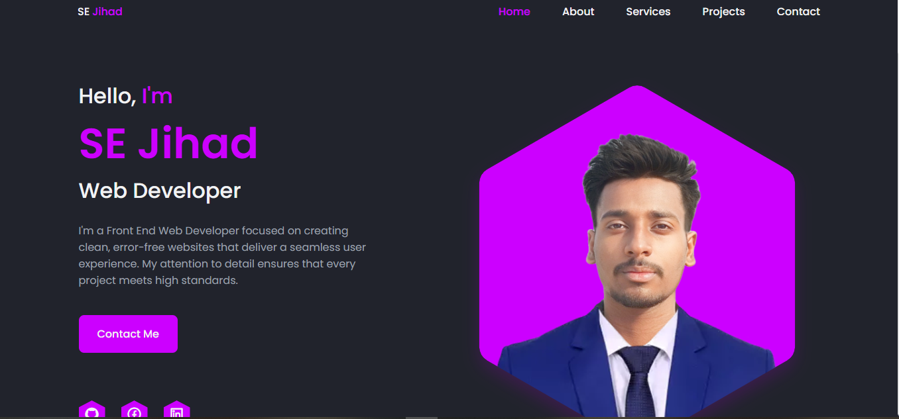

# Portfolio Website

This is my personal portfolio website, built with React.js. It showcases my skills, projects, and experience as a front-end web developer.

## Project Overview

The portfolio website is designed to provide an overview of my work, highlight my skills, and make it easy for potential clients and employers to connect with me. Built with React.js, it delivers a responsive and interactive user experience.

## Technologies Used

- **React.js**: A main framework for building the site.
- **HTML5** and **CSS3**: For layout and styling.
- **JavaScript (ES6+)**: For added functionality.
- **React Router**: For smooth navigation between sections.

## Features

- **Responsive Design**: Optimized for viewing on desktops, tablets, and mobile devices.
- **Interactive UI**: Leveraging React components for a dynamic user experience.
- **Project Showcase**: Highlights my recent projects with descriptions and live links.
- **Contact Form**: Allows visitors to reach out directly through the site.

